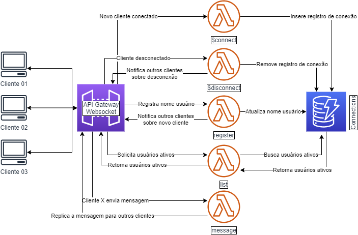
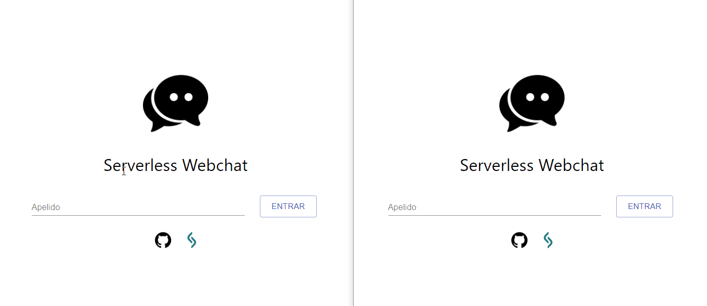

# Serverless Websocket - Webchat Sample

Este projeto é um exemplo de um chat web, utilizando um Websocket Serverless construído em arquitetura AWS. Além disso, uma pequena página web foi desenvolvida para funcionar como um chat web, desenvolvida em ReactJS.

O projeto pode ser executado no nível gratuito da sua conta da AWS para testes. Ao final dos testes, lembre-se de executar a etapa para interromper a execução.

## Arquitetura

A arquitetura utiliza os serviços:

- AWS S3
   - Armazenamento dos templates do AWS SAM/CloudFormation
- AWS DynamoDB
   - Registro dos usuários conectados ao Websocket
- AWS API Gateway (Websocket)
   - Websocket Serverless para comunicação do webchat
- AWS Lambda Function
   - Funções Lambda para registro de usuários no DynamoDB, troca de mensagens entre os usuários conectados, listar usuarios e remover usuários desconectados do DynamoDB

A arquitetura foi toda provisionada utilizando templates AWS SAM e CloudFormation, portanto, permite a replicação de forma fácil para outras contas na AWS.

A imagem abaixo demonstra o fluxo do processo.

## Aplicação

A aplicação foi desenvolvida com o framework ReactJS de forma simples, focando em demonstrar o uso da arquitetura do Websocket Serverless.

O projeto está localizado na pasta `./webchat`.

Ao acessar a aplicação, o usuário deve informar um nome de usuário e acessar o chat.
As mensagens recebidas e enviadas serão listadas na parte principal da tela. Logo abaixo um campo para digitação de texto e um botão para envio estão disponibilizados.

## Execução

Faça clone deste repositório para sua máquina local.

Para execução do projeto, é necessário subir a arquitetura na AWS, conforme os passos a seguir. Além disso, são necessários os requisitos:

### Pré-requisitos

- AWS SAM
   - Acessar a [documentação](https://docs.aws.amazon.com/serverless-application-model/latest/developerguide/serverless-sam-cli-install.html) e instalar o cliente (CLI)
- NodeJS
   - Instalar (caso ainda não tenha) o aplicativo NodeJS mais recente, disponível em https://nodejs.org.

### Arquitetura

Para reproduzir este projeto precisamos subir a arquitetura na AWS. Os templates são descritos abaixo e devem ser carregados em ordem.

Para subir a arquitetura, vamos utilizar o serviço [AWS SAM](https://aws.amazon.com/pt/serverless/sam/). Instalar conforme pré-requisito.

Abra o terminal/console no diretório do repositório clonado.

1. **AWS S3**

    O primeiro passo é criar um bucket no serviço [AWS S3](https://docs.aws.amazon.com/pt_br/AmazonS3/latest/dev/Welcome.html). Este bucket será utilizado para armazenar os templates e arquivos locais que são utilizados pelos próximos templates. Como utilizados o conceito de "Nested Stack", precisamos que o template aninhado esteja disponível em um bucket S3.

    Execute o comando: `sam deploy --guided -t s3.yml`

    Serão solicitadas algumas informações e por fim o nome do bucket criado será apresentado no console. **Guarde esta informação!**

2. **AWS DynamoDB**

    O AWS DynamoDB é utilizado para armazenar as conexões ativas no websocket. Sempre que um usuário é conectado, um registro é inserido em uma tabela do DynamoDB. Assim que o usuário é desconectado este registro é excluído.

    Execute o comando: `sam deploy --guided -t dynamodb.yml`

    Uma das informações solicitadas será o nome da stack (pilha) que será criada. **Guarde esta informação, pois será utilizada futuramente!**

3. **AWS API Gateway e AWS Lambda Functions**

    Nesta etapa, o mesmo template é utilizado para criar a API Websocket e também para criar as funções Lambda que são responsáveis pelas interações com o websocket.

    Aqui precisamos de dois comandos para execução e vamos utilizar as informações que guardamos anteriormente.

    Primeiro comando: `sam package -t websocket.yml --s3-bucket "Informe o nome do bucket S3 aqui" --output-template-file websocket_package.yml`

    Após a execução deste comando, será criado o arquivo `websocket_package.yml`. Este arquivo possui o mesmo conteúdo que o original `websocket.yml`, porém, substitui os arquivos locais por arquivos armazenados no bucket S3 informado. Além disso, este é o arquivo utilizado para subir a arquitetura desta etapa.

    Segundo comando: `sam deploy -t websocket_package.yml --capabilities CAPABILITY_AUTO_EXPAND CAPABILITY_IAM`

    Depois da execução do segundo comando, uma das informações solicitadas será o nome da stack responsável pela tabela DynamoDB (WebSocketTableStackName). Este parâmetro deve ser preenchido com a segunda informação que foi guardada, no passo do AWS DynamoDB. 

    Ao final do processo, será apresentado o endereço do Websocket, algo parecido com `wss://WEBSOCKET.execute-api.REGIAO.amazonaws.com/Prod`. **Guarde esta informação, será usada posteriormente**.

### Aplicação

Abra o arquivo `config.js` que está em `webchat/src/` com o editor de sua preferência e altere o valor da variável `websocketAddress` informando o endereço de websocket obtido no passo anterior.

Abra o terminal/console e vá até o local onde repositório foi clonado e acesse a pasta `webchat`.

No terminal, execute o comando: `npm start`.

## Interrompendo a execução

Caso você queira interromper a execução dos serviços na sua conta da AWS para evitar possíveis custos no futuro, siga este passo a passo.

1. Acesse sua conta da AWS
2. No console da AWS, procure pelo serviço AWS CloudFormation
3. Serão listadas todas as stacks (pilhas) que estão em execução em sua conta. (Fique atento a região AWS selecionada).
4. Em ordem, exclua as stacks: AWS Websocket e Lambda Functions, DynamoDB e S3.

**Obs.:** Algumas stacks estarão marcadas como "NESTED", estas stacks não precisam ser excluídas manualmente, serão excluídas quando solicitar a exclusão da stack principal.
